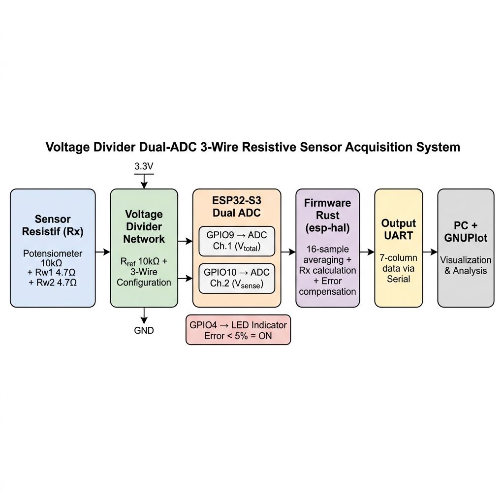
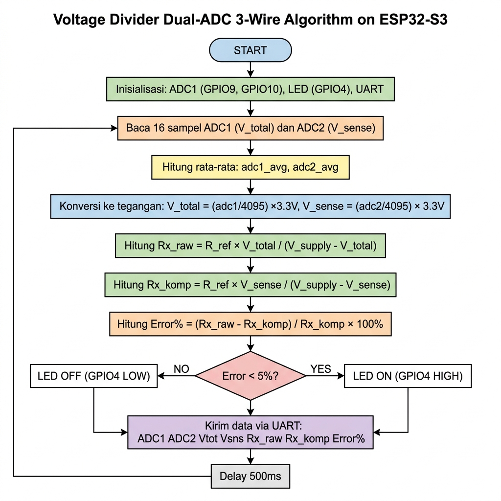
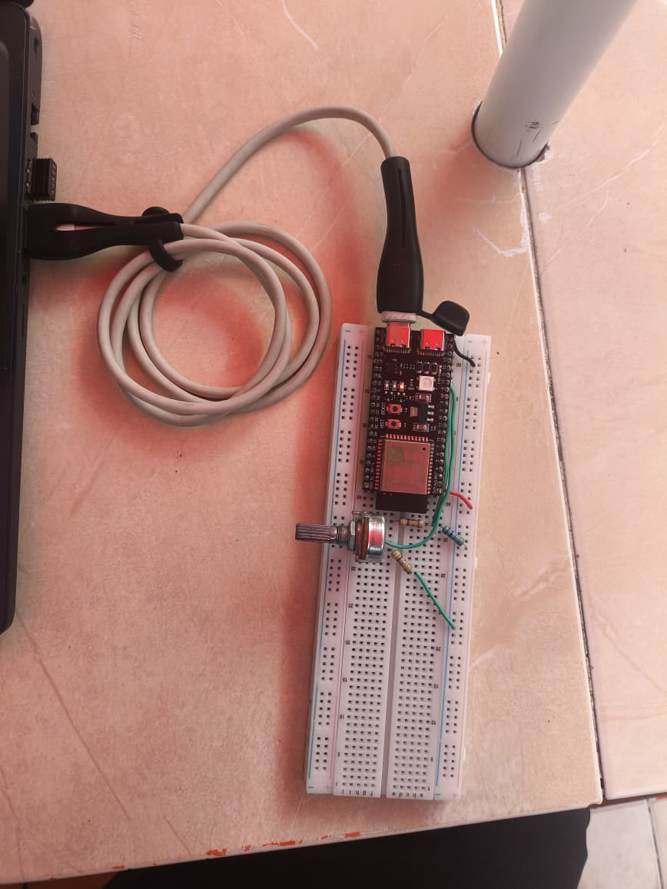
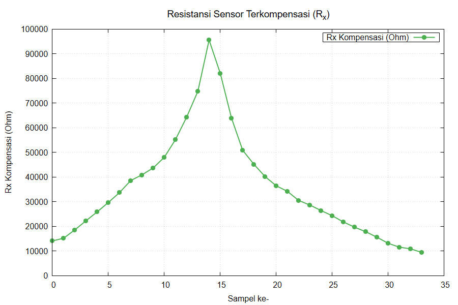
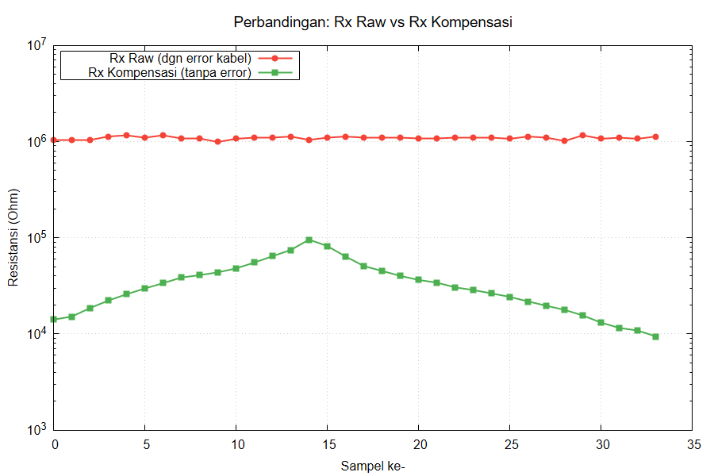
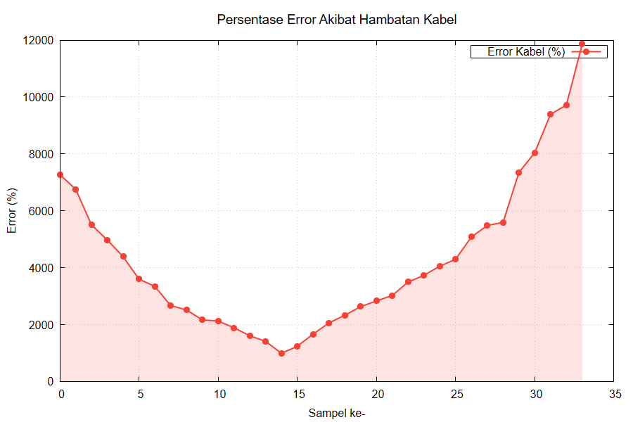

# Voltage Divider Dual-ADC 3-Wire Resistive Sensor Acquisition

A Rust-based firmware for **ESP32-S3** that implements a **Voltage Divider Dual-ADC 3-Wire** method for resistive sensor measurement with real-time wire resistance compensation.

## Overview

This project implements a novel approach to resistive sensor acquisition using two ADC channels to simultaneously measure voltage at two different points in a voltage divider circuit. By comparing these two readings, the system can detect and compensate for wire resistance errors in real-time — without requiring capacitors, timing circuits, or complex analog components.

### Key Features

- **Dual-ADC Compensation**: GPIO9 (V_total) and GPIO10 (V_sense) provide simultaneous voltage readings for wire resistance elimination
- **16-Sample Averaging**: Digital noise reduction through multi-sample averaging per reading
- **LED Status Indicator**: GPIO4 LED turns ON when measurement error is below 5%
- **7-Column Data Output**: Real-time serial output of ADC1, ADC2, V_total(mV), V_sense(mV), Rx_raw(Ω), Rx_comp(Ω), Error(%)
- **Memory-Safe Firmware**: Written in Rust using `esp-hal` (no_std) for guaranteed memory safety at compile time
- **GNUPlot Visualization**: Included scripts for generating publication-ready charts

## Hardware Requirements

| Component | Value | Purpose |
|-----------|-------|---------|
| ESP32-S3-DevKitC-1 | - | Microcontroller |
| Potentiometer | 10 kΩ | Resistive sensor emulation |
| Resistor (R_ref) | 10 kΩ | Reference resistor |
| Resistor (Rw1) | 4.7 Ω | Wire resistance emulation (upper) |
| Resistor (Rw2) | 4.7 Ω | Wire resistance emulation (lower) |
| LED + Resistor | 100 Ω | Status indicator (optional) |

## Circuit Schematic

```
                        GPIO9 (ADC V_total)
                           |
[3.3V] ── [R_ref 10kΩ] ── Node A ── [Rw1 4.7Ω] ──┬── Pot LEFT
                                                     │
                                              Pot CENTER ── GPIO10 (ADC V_sense)
                                                     │
                              [GND] ── [Rw2 4.7Ω] ──┘── Pot RIGHT

[GPIO4] ── [R_led 100Ω] ── LED(+) ── LED(-) ── GND
```

## Pin Configuration

| Pin | Function |
|-----|----------|
| GPIO9 | ADC Channel 1 — V_total (voltage at Node A) |
| GPIO10 | ADC Channel 2 — V_sense (voltage at sensor wiper) |
| GPIO4 | LED indicator output |
| 3.3V | Excitation voltage |
| GND | Ground reference |

## How It Works

1. **Voltage Divider**: 3.3V passes through R_ref (10kΩ), creating a voltage divider with the sensor resistance (Rx)
2. **Dual ADC Reading**: Two ADC channels read voltage at Node A (before wire Rw1) and at the sensor wiper (after wire Rw1)
3. **Compensation**: The difference between the two readings represents voltage lost in the wire, enabling real-time compensation
4. **Calculation**:
   - `Rx_raw = R_ref × V_total / (V_supply - V_total)` — includes wire error
   - `Rx_comp = R_ref × V_sense / (V_supply - V_sense)` — compensated value
   - `Error% = (Rx_raw - Rx_comp) / Rx_comp × 100%`

## Software Requirements

- [Rust](https://www.rust-lang.org/tools/install) (stable)
- [espup](https://github.com/esp-rs/espup) — ESP32 Rust toolchain
- [espflash](https://github.com/esp-rs/espflash) — Flashing tool
- [GNUPlot](http://www.gnuplot.info/) — Data visualization (optional)

## Build & Flash

```bash
# Install ESP32 Rust toolchain (first time only)
cargo install espup
espup install

# Build
cargo build --release

# Flash and monitor
cargo run --release
```

## Serial Output Format

```
=== Akuisisi Sensor Resistif 3-Wire (Dual ADC) ===
GPIO9=V_total | GPIO10=V_sense | GPIO4=LED
ADC1 ADC2 Vtot(mV) Vsns(mV) Rx_raw Rx_komp Error%
---
4056 2396 3268 1930 1040000.0 14102.4 7274.62
4055 2395 3267 1930 1013750.0 14088.2 7095.72
```

## Data Visualization with GNUPlot

1. Save serial output to `data.dat` (only the 7-column data lines)
2. Run GNUPlot:
   ```bash
   gnuplot plot_all.gp
   ```
3. Generated charts:
   - `grafik_adc.png` — ADC dual channel readings
   - `grafik_tegangan.png` — Voltage comparison (mV)
   - `grafik_rx.png` — Compensated resistance (Ω)
   - `grafik_perbandingan.png` — Raw vs Compensated (log scale)
   - `grafik_error.png` — Wire resistance error (%)

## Project Structure

```
.
├── src/
│   └── main.rs              # Firmware source code
├── Cargo.toml               # Rust dependencies
├── data.dat                  # Measurement data
├── plot_all.gp               # GNUPlot script
├── docs/
│   ├── diagram_blok.png      # System block diagram
│   ├── flowchart.png         # Algorithm flowchart
│   └── hardware.jpeg         # Hardware photo
├── results/
│   ├── grafik_adc.png        # ADC readings chart
│   ├── grafik_tegangan.png   # Voltage chart
│   ├── grafik_rx.png         # Rx compensated chart
│   ├── grafik_perbandingan.png # Raw vs Compensated chart
│   └── grafik_error.png      # Error chart
└── README.md
```

## Results

### Block Diagram


### Flowchart


### Hardware Implementation


### Compensated Resistance (Rx)


### Raw vs Compensated Comparison


### Wire Resistance Error


## Dependencies

```toml
[dependencies]
esp-backtrace = { version = "0.19.0", features = ["esp32s3", "panic-handler", "println"] }
esp-hal = { version = "1.1.0", features = ["esp32s3", "unstable"] }
esp-println = { version = "0.17.0", features = ["esp32s3", "log-04"] }
log = { version = "0.4.22" }
nb = "1.1.0"
esp-bootloader-esp-idf = { version = "0.5.0", features = ["esp32s3"] }
```

## References

Based on 15 academic papers (2021–2026) from Scopus/WoS, including:
- Reverter (2022) — "A Microcontroller-Based Interface Circuit for Three-Wire Connected Resistive Sensors"
- Khamsen et al. (2025) — "Simplified Three-Wire and Four-Wire Interface for Resistive Sensor Measurement Using MCU ADCs"
- Aurasopon & Jittakort (2025) — "Three-Wire Configuration for Resistive Sensor Measurement Using ADCs of MCUs"

## License

This project is developed for academic purposes as part of the Programming Controller (PEMKON) course, Semester 4, 2025/2026.

## 👨‍💻 Author

| Name | Student ID |
|------|------------|
| Natasya Tiara Regina | 2042241026 |
| Zhafran Ahmed Luxmahdy | 2042241027 |

**Department of Instrumentation Engineering**
*Institut Teknologi Sepuluh Nopember (ITS)*
